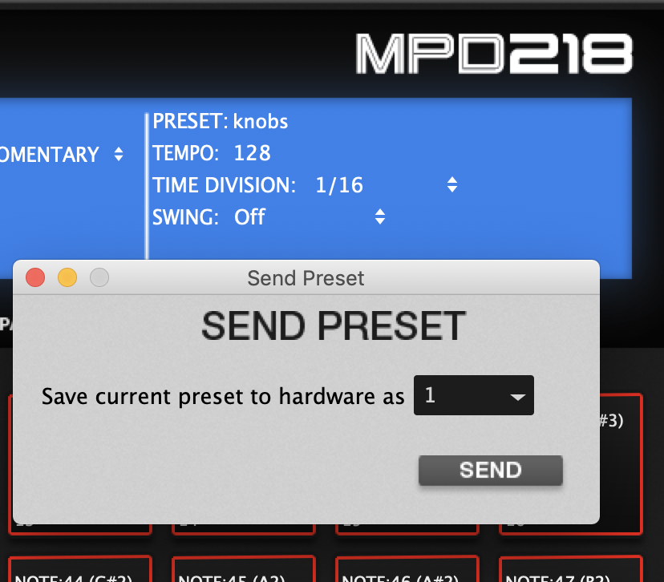

# Using MPD218 with Ableton Live

## 1. Download MPD218 - Editor for your OS

[MPD218 - Editor](http://www.akaipro.com/products/pad-controllers/mpd-218)

## 2. Send presets to Hardware

I used slot 1 and 2

***1 for knobs (PRG + Pad 1)***

***2 for sliders (PRG + Pad 2)***

## 3. Copy MPD218 folder into "MIDI Remote Scripts"-Folder

## 4. Open Ableton and set settings

## 5. Send presets to Hardware

a) (PRG + Pad 1) Knob-Preset (knobs control the 8 macros, or whatever ableton automaps)

b) (PRG + Pad 2) Slider-Preset (knobs control sliders)

Make music, get into flow, enjoy.
